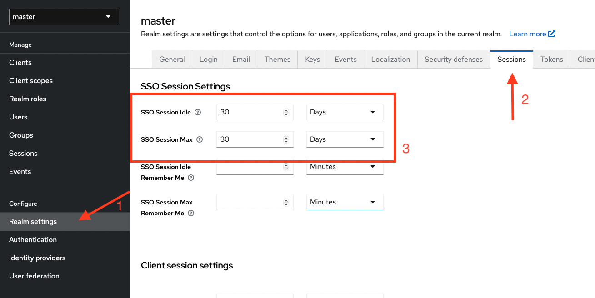
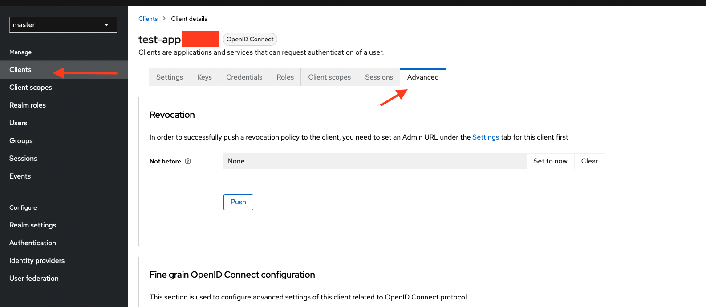
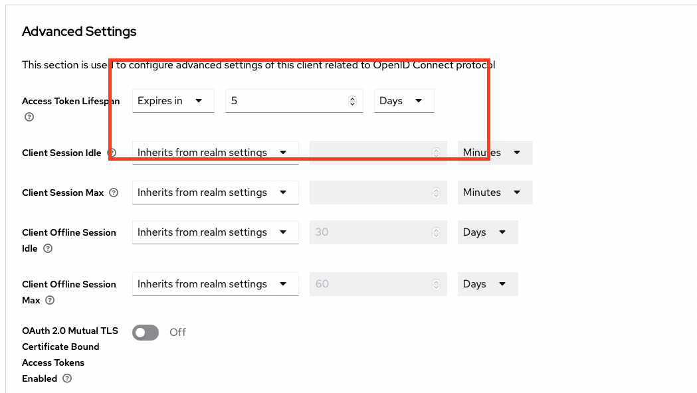

# Authorization and Authentication for FastAPI Applications

This repository provides a package that facilitates token-based authentication and authorization within your [FastAPI](https://fastapi.tiangolo.com) application. 

It builds on top of [Authlib](https://docs.authlib.org/en/latest/#) and provides a simple interface for protecting your own FastAPI endpoints with token-based authentication using OAuth.

It is the result of a client project of [Schroeck IT Consulting](mailto:hello@schroeck-consulting.de). 
The goal was a simple FastAPI integration with Keycloak without much manual interference needed. Hence, the code is very much focused on Keycloak.

However, it should work for most other OAuth IdP's. If you require RBAC (Role-based access), make sure to name the claim containing the roles,  ``roles``.

# Features

- Get an API token for your fastAPI app using your favorite IdP via OAuth. This library simplifies the process by giving you the required endpoints and the login mechanism
- Protect your endpoints by just adding a dependency to the endpoint functions
- Support for role-based access control for endpoints

## Contact

This library was originally published by [Schroeck IT-Consulting](www.schroeck-consulting.de). 

Email: [hello@schroeck-consulting.de](mailto:hello@schroeck-consulting.de)

## Installation

Simply pull the package from Pypi:

``bash
pip install fastapi_oauth_client
``

## Overview

This package enhances your FastAPI application by incorporating token-based authentication and authorization mechanisms.

**Key Features**:

- Addition of two endpoints, `/login` and `/callback`, implementing the standard OAuth / OpenID connect flow via a web browser.

- Users authenticate through the `/login` endpoint, which redirects them to the Identity Provider (IdP), such as Keycloak, for login.

- Upon successful login, users are returned to the FastAPI app with an access token obtained from the IdP.

With the obtained access token, your FastAPI app gains the ability to access protected endpoints. This token remains valid for machine-to-machine communication until its expiration.

## Implementation Steps

To integrate this package into your FastAPI app, follow these steps:

1. Configure OAuth settings by setting the necessary environment variables. Refer to the [example.env](example.env) file. For testing purposes, update settings in that, and run FastAPI using the command: `sh ./run.sh`.

2. Incorporate the login endpoints into your code:

```python
from fastapi_oauth_client import auth_router, verify_token
from starlette.middleware.sessions import SessionMiddleware
from fastapi import FastAPI
import secrets

app = FastAPI(

    title="Your App Name",
    version="1.0.0",
    description="Description of your app.",
    openapi_tags={},
)

# Integrate the login endpoints
app.add_middleware(SessionMiddleware, secret_key=secrets.token_urlsafe(16))
app.include_router(auth_router)

```

3. Secure your endpoints using the access token:

```python
from fastapi_oauth_client import auth_router, verify_token
from fastapi import Depends, FastAPI
import secrets
from starlette.middleware.sessions import SessionMiddleware

app = FastAPI(
    title="Your App Name",
    version="1.0.0",
    description="Description of your app.",
    openapi_tags={},

)

# Integrate the login endpoints
app.add_middleware(SessionMiddleware, secret_key=secrets.token_urlsafe(16))
app.include_router(auth_router)


@app.get("/protected_endpoint")
def doSomething(profile=Depends(verify_token(roles=["admin"]))):
    """
    Docstring...
    """

    return "OK"

```

Note: It's crucial to declare the 'SessionMiddleware'. This declaration enables FastAPI app to extract the Bearer token from the incoming request.

## Keycloak Configuration

Before proceeding, ensure you've configured a client in Keycloak. Assuming this is done, follow these steps to extend token lifetime:

1. **Realm Settings**: Navigate to the realm settings in the Keycloak administration console. Access the "Sessions" tab and extend the session lifetime as shown:



2. **Adjust Client Settings**: Next, extend the token lifetime for the specific client. Select the client and head to the "Advanced" settings tab:




## Accessing Protected Endpoints

To access protected endpoints, include the `Authorization` header in your 
requests. Provide the Bearer token obtained after login:

```http

GET /protected_endpoint HTTP/1.1

Host: your-api-host

Authorization: Bearer ey...

```

## Log Level

This package uses Loguru for logging. To adjust its loglevel, use the environment variable ``LOG_LEVEL``.